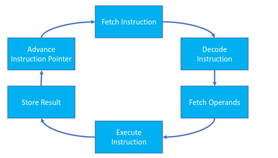
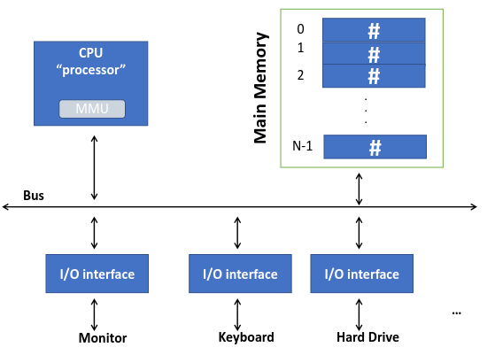
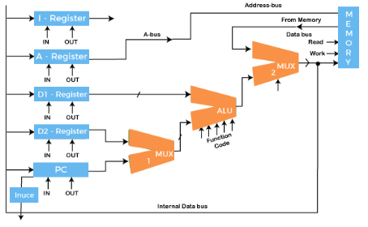
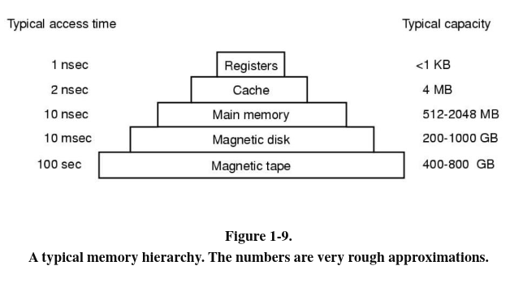
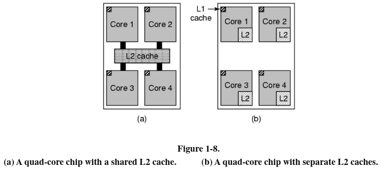
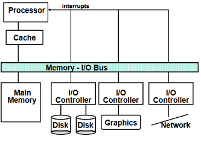

- #definition Von Neumann Architecture
- Common computational bus that the components communicate through
- Idea of how a computer should look, and how componants interact
- 'stored program' arch
- Memory organized into addressable read/write storage locations of a fixed size, eg. 16bit all memory is 16bit, 32 bit, all memory is 32 bit.
- memory contains both data and instructions
- by default, program execution proceeds sequentially
	- #definition Fetch-Execute Cycle
	- Fetches, decodes, executes, saves results one by one
	- 
	-
-
- 
- #definition Von Neumann Execution Cycle
- #definition Main Memory
- #definition Secondary formatMemory
- #definition IO Devices
- #definition Busses
- What is a computer?
	- A Computer is something that uses a __program__ and __internal__ data to transform input into an output
	- Input -> output
	- Uses a program and internal data to transform input->output
	- machine processes data by following precise instructions
	- Computer store and process numbers *and only numbers*
	- Machine that can be programmed to **automatically** carry out  sequences of **logical** and **computational** operations
	-
- #definition Data
	- Collection of facts
	- unorganized
	- does not depend on information
	- isn't sufficient for decision making
- #definition Information
	- puts facts into context
	- organized
	- depends on data
	- sufficient for decision making
- #definition Program
	- Set of precise instructions that can be followed
	- Modern computers - a program contains a one-at-a-time sequence of instructions
- #definition Computer Architecture
	- Conceptual design and functional behaviour of a computer system as seen by the programmer.
	- deals with "what the computer does"
	- 
- #definition Computer organization
	- Deals with the physical implementation and operational structure of the computer
	- deals with "how the computer does it"
	- 
- #definition Stored Program Arch
	- Hardware is reprogrammable.  Von Neumann.
	- program data can me created, replaced, fixed and edited.
- #definition Fixed program arch
	- Each program is preprogrammed and 'fixed' in place, E.G a regular calculator, plus is always addition, minus is always subtraction
- #definition Harvard Architecture
	- Data goes in one memory, instruction in another, no conflict between data/instruction.
- #definition Instruction Register
- #definition Program Counter
- #definition Pointer
	- Points directly to a memory location.
- What is a CPU?
	- carries out the instructions of a computer program
	- Arithmetic/logic operations
	- read data to memory
	- write data to memory
	- read data from input devices
	- write data to output devices
- Three stage pipeline, fetch->decode->execute takes three timeslots
- Superscalar CPU fetch/decode in parallel, into a holding buffer, to different execute units.
- #memory Memory Heirarchy
	- 
- #definition Register
	- Small amount of memory available as part of the CPU
	- Data registers
	- Special registers
		- Program Counter, Stack Pointer
- #definition Cache
	- Memory on processor that is used to reduce average time access data
	- Smaller/faster than main meory
	- Contains copies of freq used data 'closer' to the processor, low read time
	- Cache hit vs cache miss
		- Since purpose of the cache is to speed up access time to memory, if data is already in the cache, the CPU will use data in the cache.  If data is there, Cache hit, in the event it's not, Cache miss, and the CPU has to locate the data in secondary memory.
	- L1 vs L2 caches
	- 
	-
- #definition #memory Main Memory
	- An array of **addressable**, **fixed-length** memory locations
	- addresses are numeric values starting at zero
	- Every memory location contains a number
	- Main Memory is **volatile** (resets when no power/turned off/reset computer)
	- Computer can manipulate data in main memory
		- **all data must be coped from a storage device to be used**
- #definition #memory Secondary Memory
	- Non-volitile - data retained without power
	- Large storage capacity - can store large amounts of data compared to main
	- slower access - takes more time to fetch data
	- permanent storage - used for long-term file/program/operating system storage.
- #definition IO devices
	- Input/Output (IO)
	- Bus is the connection between processor, mmeory and IO
	- Protocols on the bus interrupts used for comms among devices and processor
	- 
	- #definition Polling
		- When the CPU is asking what's happening with the IO device
		- professor asks a student "Do you understand this?"
		- Checking for requests etc.
	- #definition Interrupts
		- When the IO device sends a signal to the CPU
		- Student asks the professor "I understand this."
-
-