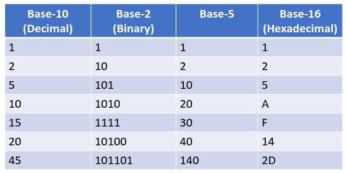

- #definition Bus - Transfers data between ddifferent devices in the computer
	- Control line signal requests and acknowledgements
	- Data lines carry info btwn source and destination
	- Bus advantages
		- versitile, single scheme for easy add-ons
		- low cost, single set of wires shared in multiple ways
	- Bus disadvantages
		- Comm bottleneck, bandwidth limits, maximum IO throughput
		- devices will not always be able to use the bus when they need to
- #evolution Evolution of Computers
	- Pre digital era
		- computer was a job title, something people did, a person who used to computer using an abacus/paper etc
	- mechanical era (0th gen)
		- mech calculator invented by Blaise Pascal 1642
		  collapsed:: true
			- Add/subtract two numbers directly, multiply/divide using repeated add/subs
		- analytical engine Charles Babbage 1837
			- Mech gears where each gear represented 0-9
			- Programs provided as punched cards
			- never completed
			- Designed to be universal machine
			- capable of any mathematical computation
			- programmed by Ada Lovelace
		- Vacuum Tube era (1st gen)
			- First machine created, all programming in pure machine language
			- stored program concept.
			- great big huuuuge computers.
			- https://w.wiki/4igg
			  https://w.wiki/B62h
		- Transistor era (2nd gen)
			- era of mainframes (IBM7094)
			- transistors instead of vac tubes.
			- programmed in assembly and FORTRAN
			- batch systems, IO was seperated from calculations
			- punched cards and mag tape
			- loaders (OS ancestors)
			- commodification of computers.
		- Integrated Circuit Era (3rd gen)
			- Computer lines using same instruction set ISA
			- first operating systems OS/360, MULTICS
			- *Multiprogramming* and *timesharing* (job 1, for 5 second, job 2 for 5 seconds, job 3 for 5 seconds, back around) Sharing time between multiple programs.
			- save power, cheaper to make, more consistent
			- prog languages, LISP,BASIC,C
			- Computer as a utility
		- VLSI / Desktop Era (4th gen)
			- personal computers
			- shared arch, x86, Itanium, ARM, MIPS, SPARC, RISC-V
			- OS like UNIX, MINIX, Linux, MacOS, DOS Windows
			- ISA (CISC, RISC, VLIW), caches, pipelines, hyperthreading, multicore
		- Mobile era (5th gen)
			- extension of desktop computeing, same arch, less powerful, less memory
			- mobile devices, embedded systems, IoT devices
			- Custom processors and FPGAs
			- Mobile OS, Symbian, IOS, Android, Windows Mobile
			- Real Time OS - If you ask something, it should respond in a certain time limit.
		- Virtual computing era
			- Use virtual machines - where software sims the hardware of another machine
			- can be small scale, - jvm, mid scale - virtual box, large scale - shared computing platform like Amazon EC2
			- more security/flexibility
			- can buy computing time rather than hardware.
- #os What is an operating System?
	- program that after being loaded manages all the other application programs in a computer
	- Application programs make use of the Os by making requests for services through Application Program Interface (API)
	- Amalgm of a number of independent programs
		- Includes multiplexing of devices in two ways;
			- Time multiplexing - sharing serially-reusable resource among several users - each user gets a little bit of time before moving across time.
			- Space multiplexing - dividing a multiple use resource among up among several users - a bunch of users accessing a shared drive.
			- 
- #TODO sample quiz on D2L
- #information Information representation
	- Humans use digits 0-9, alphabet, punctuation
	- Computers use digits 0 and 1
- #definition Bit - basi unit of information in computer memory *bi*nary digi*t*
	- represent numbers, code, instructions
	- single bit is enough to distinguish between two values, off and on
- positional number systems
	- humans use decimal 10 digits - think of 0-9 as the atomic elements, very low basic form
	- base 10 - decimal
	- base 2 - binary
	- base 16 - hex
	- subscript tells which base the number is in $base_{10}$
	- Left most digit MSD most significant digit, Right most Least significant digit
	- we can generalize base-10 to any base-B, so long as B>=2
	  |number of digits|Base-10|Base-B|
	  |Range|0-9|0-(B-1)|
	- #base For base > 10, we use letters
		- base-16 0-9, A,B,C,D,E,F
	- #base base 11 0-9, A
		- To represent 11, $10_{11}$
		  $1\times11^1 + 0\times11^0$
		  $= 11$
	- number(N): $d_nd_{n-1}...d_2d_1d_0$
	- #base expanded to base 10:
	  $(d_n\times10^n)+(d_{n-1}\times10^{n-1})+...+(d_2\times10^2)+(d_1\times10^1)+(d_0\times10^0)$
	- 
	- $10$ by itself is ambiguous, the meaning depends on the base. $10_{10}\ne10_2$
	-
		-
-
-
-