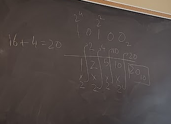

- #base convert from base to another base
	- Base-B to Base-10, sum expanded representation and #horners Horner's Rule
	- Base-10 to Base-B, repeated division and Largest Power
	- Base-B to Base-C, convert to Base-10, then to Base-C
- #base #horners 
  $sum=0_{10}$
  For all digits in the number N, *starting from the left and moving to the right*, do the following:
  $sum=(sum\times B)+$Digit value
  $sum$ will be your base-10 converted number
	- Polynomials in the form:
	  $A(n)=a_0+a_1 \times n+a_2 \times n^2 + a_3 \times n^3 + ...$
	  Can be represented as:
	  $A(n)=a_0+n(a_1+a_2n+a_3n+...)$
	- |Digits|Step|Sum|
	  |$AF452_{16}$| |$0_10$|
	  |$F452_{16}$|$sum = (sum \times 16) + A = (0 \times 16) + 10 = 10_{10}$|$10_{10}$|
	  |$452_{16}$|$sum = (sum \times 16) + F = (10 \times 16) + 15 = 175_{10}$|$10_{10}$|
	- Easy way, start at most significant, and move left
	  
-
- #base #division Repeated division method
	- Simplified - repeatedly divide the base-10 number (N) by the base you want to convert to(B) until the quotient is 0.
		- $Q=\frac{N}{B}$
	- During the process, keep track of the remainder (R) after each division
		- $R=N\%B$
	- Resulting sequence of remainders in reverse order now becomes the new number in base-B
	- 
	- 
- #base #largepower Largest Power method
	- Simplified procedure
		- List out the powers until a power larger than the number being converted is reached
		  logseq.order-list-type:: number
		- Use the power *one less* than the largest power reached
		  logseq.order-list-type:: number
		- Determine the calue of the digit that 'most fills' the number and set the digit to that value
		  logseq.order-list-type:: number
		- reduce the number by (the digit value x the place value) cimputed in step 3
		  logseq.order-list-type:: number
		- Using the powers listed in step 1, reapeat step 2 and 3 for the reduced number until reach 0
		  logseq.order-list-type:: number
		- 
		-
-
-
-
-
-
-
-
-
-