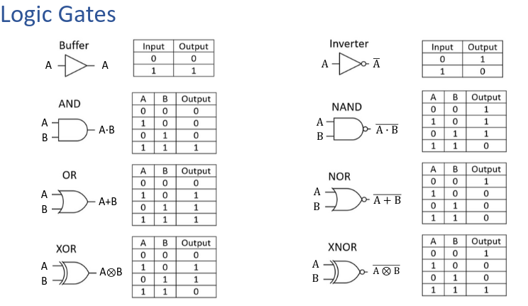

- #logical #binary #definition Bit Shifting
	- manipulate the binary representation of integers by shifting their bits to the **left** or **right**.
	- Binary operator
	- *three* types of bit shifting operators
		- << left shift
			- Moves bits to the left by the number that is specified
			- Zeroes are shifted into the least sig bit (rightmost)
			- $001101_2  << 1 \rightarrow 011010_2(13_{10}\times2^1=26_{10})$
			  $001101_2 << 2 \rightarrow 110100_2 (13_{10}\times2^2=52_{10})$
			- If there's no leading digit, it goes away. If the most sig is a zero, your're multiplying by 2
			  $1101<<1\rightarrow1010$ 13 becomes 10
		- \>> *signed* right shift
			- shifts bits to the right
			- most significant bit is **repeated**
			- $001101_2>>1\rightarrow000110_2$ Zero means a zero is added
			  $101101_2>>2\rightarrow111011_2$ One means a one is added.
		- \>>> *unsigned* right shift.
			- Shifts bits right by number of bits
			- Zeros are shifted into the most significant position
			- effectively dividing by $2^{positions}$
			- $001101_2 >>> 1\rightarrow 000110_2$
			  $001101_2>>>2\rightarrow000011_2$
- #binary Bit Masking
	- technique used to manipulate specific bits within an integer by applying a *bitwise* operation in combination with a **mask**
	- binary value where specific bits are set to 1(or0) depending on which bits you want to manipulate.
	- $01010101$ REGISTER
	  $00000110$ XOR MASK
	  $01010011$ RESULT
	- Masking using OR operator - Masking to 1
		- keep a bit unchanged at a specific position, set the corresponding bit in the mask to 0
		- To set a bit to 1, set the mask to 1
		- Set position 1 and 5 to 1.
		  $10000001$ REGISTER
		  $00100010$ OR
		  $10100011$ RESULT
	- Masking using AND - Masking to 0
		- keep a bit unchanged, set the mask position to 1
		- set a bit to 0 at a psecific position, set the mask position to 0
		- Set position 1 and 5 to 0
		  $011111111$ REGISTER
		  $11011101$ AND
		  $01011101$ RESULT
	- Masking to toggle bit vale
		- Use XOR
		- to keep bit unchanged, set bit mask to 0
		- to toggle a bit, set the position to 1.
- #logic 
	-
-
-
-
-
-
-