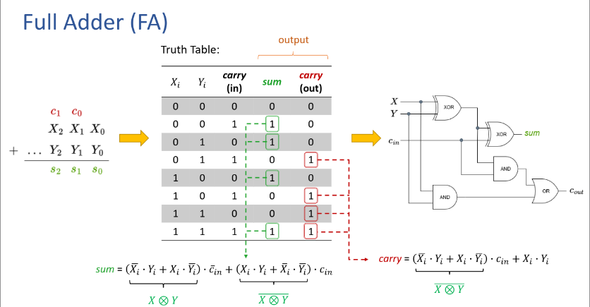
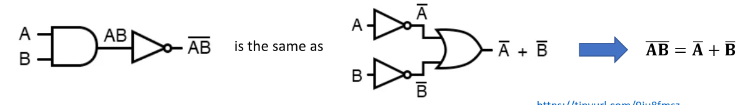
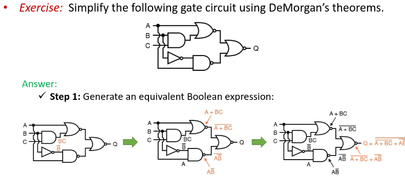

- 
- #logic DeMorgans - an OR gate with all inouts inverted behaves the same as a NAND gate, and an AND gate with all inputs inverted behaves the same as NOR gate.
	- the equivilance in 'backward' form, inverting the output of any gate results is equivilant to the opposite type of gate
		- Works only for AND/OR
			- 
				- 
					- Remove longest bar first when inverting.
-
-
-
-
-
-