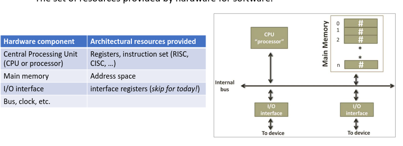

- Endianness #endian
	- When data requires more than one byte to be encoded, know ahead of time the order
	- Little-Endian - least sig byte starts at lowest address, then increases.
	- Big-Endian - Most sig byte is placed in the lowest memory address
- ASCII American Standard Code for Information Interchange
	- 128 unique alphabetic, numeric, special characters and control codes
	- 7-bit, usually stored in 8-bits
	- Extensions to ASCII use the 8th but, 256 characters
	- [Ascii table](https://www.asciitable.com/)
	- $0_{10}-31_{10}$ Control characters
	- $48_{10}-57_{10}$ Decimal digits
	- $65_{10}-90_{10}$ Uppercase letters
	- $97_{10}-122_{10}$ Lower case
	- upper/lower are 32 apart
- Unicode encoding
	- Unicode transformation format (UTF) marks the type of encoding scheme,
		- UTF-8,UTF-16,UTF-32
	- First 128 characters are the same as ASCII
	- Multi-byte system
- #architecture what is computer architecture?
	- The set of resources provided by hardware for software
	- set of resources provided for programmers to work with
	- 
- #address Address Space
	- Memory is organized into fixed-size locations for binary numebrs
	- typically 8bits wide
	- not uncommon to have 32-bit or 64-bit addresses
	- memory space that a cpu or process can access/read/write
	- Physical address space
		- Physical space on the RAM where the data is physicall stored
	- Virtual address space
		- logical view of memory that a process sees (not in the course)
	- **Always** interpreted as unsigned numbers!
	- value stored can represent any data type
- #cpu Control Unit (CU)
	- Circuit that directs all other CPU activities, like a conductor
- #cpu Arithmetic and Logic Unit ALU
	- Library of arithmetic and logic circuits (adder, XOR, AND, OR) .
	- CPU delegates various arithmetic/logic operations to the ALU
- #cpu Register
	- Fast memory componants on-board the CPU
	- register has a name, but not an Address
- #cpu can do things like:
	- Load operands from memoy into registers
	- perform operations on the operands
	- store result back into memory
- #cpu Instruction Set
	- Fixed list of instructions that the CPU can execute, add/subtract/and/or/etc
- #program
	- modern computer use stored prog arch, memory contains code and data, data and code can be modified
	- Program is stored as a sequence of numbers that translate back to CPU instructions
	- first instruction of the program resides at a specific location in memory, every instruction after taht follows consecutively.
-
	-
	-
-
-
-
-
-
-