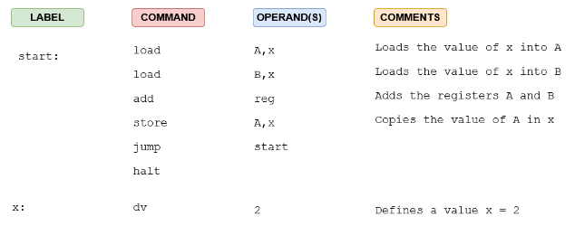

- what memory is, how it works, how addressing works everything up to lecture 6.1/labs/midterm samples
- #mach Machine Language
	- Each instruction has a numeric value (an opcode) associated with it.  Instructions are represented in binary language not **mnemonics** (Labels for opcodes)
	- each arch has a specific representation of how instructions are encoded
	- each instruction performs a specific task, such as load/jump/add etc.
- file assembly file portable bytecode, virtual machine java jvm,
- #definition Compiler - translates the entire program into assembly code before execution
- #definition Interpreter - translates the code line-by-line as it is being executed.
- #definition Assembler - converts the assembly code to machine code for the CPU to execute
- #definition Assembly - low level programming language for any computing device, hardware specific. converted into executable machine code by assembler
- #assembly 4 main columns Label, Command, operand, Comment
	- 
- #assembly Defining variables (dv) should be done at the end of the program.
- #assembly start: is good practice to label the start of the program.
- #assembly Instructions can contain **one**, **two** or **zero** operands
- #assembly Two types of addressing modes
	- #definition Absolute Addressing mode
		- an instruction points directly to a fixed specific memory location, tis address does not change dynamically, it always refers to the same memory location
			- ```start: 
			  start: 		Load		A,x
			  			Load		B,x
			              // x is a named memory location
			  ```
	- #definition Relative addressing mode
		- an instruction references a memory location relative to the current instruction, address is dynamicallt computed based on current instructions location
		- ```
		  jump		start
		  // jump is calculated relative to the program counter location
		              
		  ```
- #definition Data Transfer - instructions place a value into a destination move, store, load
- #definition Arithmetic/Logic Operation - perform a    computation, add,sub,and,or,xor,not
- #definition Program Sequencing and Control - affect the flow of control and the CPU state. implement decisions, loops, subroutines jump, halt, etc.
- #assembly #definition Single-pass assembler
	- assembler goes through the source code once and translates it into machine code in a single pass
	- does not go back to resolve forward references
	- requires strict ordering, meaning symbols must be defined before they are references
- #assembly #definition Two-Pass assembler
	- the assembler scans source code twice
		- First pass - collects labels and symbols into a symbol table
		- Second pass - uses the symbol table to resolve forward references and generate machine code
	- more flexible, takes longer because it runs through the code twice
- #assembly #definition Symbol Table - Table that maps labels to memory locations
- | |Base|Range of digits|
  |Binary|2|0-1|
  |Decimal|10|0-9|
  |Hex|16|0-F|
- $$492_{10} \rightarrow B6 \\
  $$
- $$123_9 \rightarrow B10 \\$$
  Without Horners
  Sum expansion
-
-
-