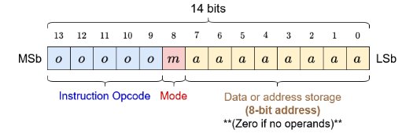

- #sca Simple Computer Architecture
	- Main memory - 8 bit address written in hex ,256 unique addresses
	- ALU uses two registers A/B
		- 14 bit values
		- A has more flexibility than B, A can read in data , write data,
		- B can only be read into and cannot be used to write or print
	- #definition IR Instruction Register
		- 14 bit values
		- Holds the most recently fetched program instruction
		- **Instruction** goes from main memory to here
	- #definition PC Program Counter
		- 8 bit values
		- Holds the address of the next program instruction
		- Instruction **address** from MAIN memory goes here for NEXT instruction
	- #definition Status Register
		- VZN -  3 bit value - **N**egative-**Z**ero-o**V**erflow
			- N - if value == 1, result of the operation is negative
			- Z - if value == 1, result is zero
			- V - if value ==1, result caused an overflow
		- Holds the status results of the most recent operation in the ALU
		- can be checked for ALU errors.
		- Set of bits that tells you about the status of the previous instruction
	- #definition ISA Instruction Set Architecture
		- 32 Instructions, 14-bits
		- five most sig bits - OpCode
		- bit 8 is Mode
			- Mode 0 - working with register A
			- Mode 1 - working with register B
		- least sig 8 bits - data or address storage - 0's if there are no operands
		- 
- #SCA pseudo code
	- ```
	  set value = 3;
	  print (value + 4);	
	  ```
	- Assembly code:
		- ```
		  Start:	load	A	value
		  		Addi	A	4
		          write
		          halt
		  value:	dv			3
		  ```
	- Machine code
		- |main address|code in hex|
		  |0x00|$0404_{16}$|
		  |0x01|$0E04_{16}$|
		  |0x02|$0200_{16}$|
		  |0x03|$3000_{16}$|
		  |0x04|$0003_{16}$|
-
	-
-
-