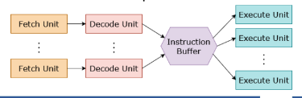
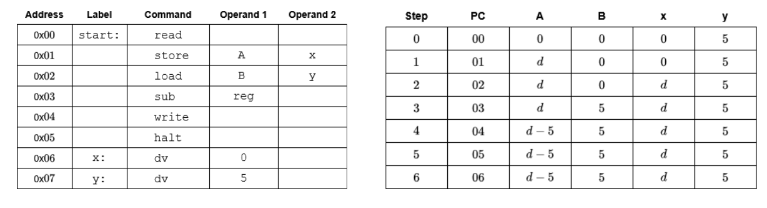
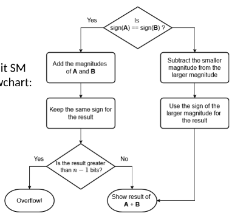

- #definition Fetch Decode Execute cycle#FDE
	- how a computer runs programs. it repeats three steps:
		- Fetch - CPU get the next instruction from memory, like reading a line from a recipe
		  logseq.order-list-type:: number
		- Decode - CPU figures out what the instruction means by partitioning it into OPCODE,MODE,DATA/ADDRESS
		  logseq.order-list-type:: number
		- Execute - CPU carries out the instruction, e.g. adding two numbers would happen now.
		  logseq.order-list-type:: number
- #FDE used in the #SCA
	- each instruction requires one clock cycle, first clock to fetch, second to decode, third to execute - this is slow
- #FDE #definition Three-Stage Pipeline approach
	- introduced to overcome three clock cycle slowness
	- on each clock cycle, when an instruction$i$ moves to decode, another instruction$i+1$ moves to fetch. then when $i$ moves to Execute, $i+1$ moves to decode, and $i+3$  is fetched
	- Instructions are still executed in series, and we run into a problem if $i$ is a branch
- #definition Superscalar Method
	- instead of one unit for each stage, we can have multiple units.
	- Fetch multiple instructions - CPU fetches more than one instruction
	  logseq.order-list-type:: number
	- Decode instructions at the same time - decodes the instructions at the same time to understand what needs to be done
	  logseq.order-list-type:: number
	- Execute simultaneously - has multiple "execution units" to perform several tasks at the same time - one can do math, one can move data, etc.
	  logseq.order-list-type:: number
	- 
	- #definition  Branch Prediction
		- CPU guesses which path will be taken and continues fetching and executing instructions ahead of time
		- if the guess is right it runs smooth and fast.
		- if the guess is wrong, it flushes the pipeline and starts over from the correct spot, small delay, but overall faster than waiting for a decision everytime.
- #debug debugging the #SCA
	- At the start of the program, reset all registers to 0
	  logseq.order-list-type:: number
	- Load the Instruction Register with contents (14 bits) of memory address in the Program Counter
	  logseq.order-list-type:: number
	- Increment the PC by 1
	  logseq.order-list-type:: number
	- Decode and execute the instruction in IR. This may update A,B,PC,and SR registers
	  logseq.order-list-type:: number
	- Repeat 2-4 while the instruction is not HALT.
	  logseq.order-list-type:: number
	- Example:
	- 
- an $n$-bit fixed length can represent $2^n$ numbers
- #signedNumbers representing positive and negative values with a fixed length (8-bits, 16-bits-etc)
	- #definition Signed Magnitude (SM)
		- to represent negative base-10 numbers, put a negative sign in front of the most significant digit E.G. $-14_{10}$
		- a sign has two possibilities, so it would require one bit to represent the $-$ sign
		- $0$ would denote a *positive* number
		- $1$ would denote a *negative* number
		- Take the absolute value of the number and convert to binary
		  logseq.order-list-type:: number
		- if the binary value is $n-1$ bits, move forward, otherwise it cannot be represented in signed magnitude
		  logseq.order-list-type:: number
			- store it in bits,
			  logseq.order-list-type:: number
			- add leading zeroes if needed
			  logseq.order-list-type:: number
		- if the number is negative, change the MSb to 1, otherwise set the MSb to 0
		  logseq.order-list-type:: number
		- Unsigned can represent $0$ to $2^{n-1}$
		- SM can show $-(n^{n-1}-1)$ to $(2^{n-1}-1)$
		- 
		- Pros: Easy for humans to understand, the MSb = 1, number is negative!
		  Cons: Sophisticated arithmetic circuits needed to handle two representations for zero and multiple sign cases
	-
		-
		-
	-
	-
		-
-
-