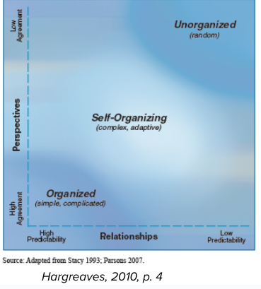

- #cas Complex Adaptive Systems
- What is a system? Is it a pile, or a system?  Removing one article of clothing from a pile does not change the *function or purpose* of the pile, with a system, additions or subtractions change the process and outcome.
- Systems are greater than the sum of the parts, Systems have purpose.
- #definition Entropy - When a system loses energy. When a system loses something, and erodes to decays.
- #definition Closed system - Does not receive any outside information, parts, or energy. (Self winding clock)
- #definition Open system - System that interacts with the outside environment, receives new information, parts, energy or values. (The money I bring to MRU comes in, I come in, and both will leave eventually.)
- Ludwig Von Bertalanffy - What can explain surprise? An explanation of systems thinking, why is it that what I'm seeing in my mathematics doesn't match what I see in the world?
- Generally speaking, systems have parts, parts have relationships, relationships have outcomes.
- Systems have boundries, not always clear or physical.  systems based on humans, or biological systems those boundries can become unclear.
- #definition Ecotone - Where two systems overlap, ecologically the most creative and innovative places.
- #definition non-linearity - outcomes are often contingent on lower level interactions
- #definition Interdependence
- What we can see, look at the patterns, Structures, mental models(Iceberg)
- #cas #definition Complex - exhibits self-organization (Holling, 2001) Emergence and uncontrollable
	- Self-organize - without the intervention from outside, system and create and adapt.
	- Trial & Error are common, replication hard *context and timing matters.*
	- Outcomes are often contingent *#nonlinearity*
- #cas Complex system v problem
	- complex systems are adaptive as well as messy, but not full chaos.
	- You identify a complex problem to study, but they are influenced by the dynamics of complex systems.
	- A clock - highly predictable, organized, but not self organizing.  A calgary - self organizing and adaptive to new situations.
	- 
	-
- #cas Adaptive - self organization, can respond or be proactive
	- Responds to the world around and inside, Fire clears area, and new things grow
	- Behaviours at different levels respond and learn
	- Urbanization & London in the 19th Century: Londond grows independent of any policy (and contrary to the wishes of many); it creates entire sub-industries like mudlarks to deal with garbage; housing fixes etc.
-
-