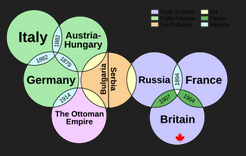

- #boundaries #definition Parameters, like Boundaries but different
	- Rules of stock and flow that determine minimums and maximum.
	- Slow to change, and meant to influence how, when, and how much stocks and flow travel through the system
	- Rules-based but focused on minimums and maximum allowable flows
	- if min/max are breached, we would expect to see qualitative changes in the system functions
- Parameter - how much water can the bathtub hold?
- Boundary - how much water do *I* want in the tub?
- Marina
	- What is the purpose?
		- Maintain a rich, mixed use public space.
	- What are the hard boundaries?
		- Boats are a pain to move, the marina has a limited physical size.
	- What are the ambiguous links?
		-
	- Test it out
- #definition External Shock
	- Something that affects our system from outside the boundaries of the system.  Our system might be a part of a broader system, this doesn't change the boundaries of our system. e.g. fraz ferdinand gets shot, Canada is at war because we're part of the British Empire a the time.
	- 
- #definition Analytical boundaries
	- research based - what's our question?
	- cultural 'imagined community' - you don't need to know everyone, but there are rules of membership and out-groups
	- economic - dominant approaches(industries, theories)? shared currency? shared markets?
	- Experiential - how do people live and move? are they highly mobile ot hyper-local?
	- Key questions:
		- how and by whome are we governed? does it matter?
		  logseq.order-list-type:: number
		- how is worth/merit/value determined? who makes those decisions?
		  logseq.order-list-type:: number
		- how do we feed, clothe, and care for ourselves?
		  logseq.order-list-type:: number
		- who is a member? who is not. how is membership determined?
		  logseq.order-list-type:: number
-
-
-
-
-
-