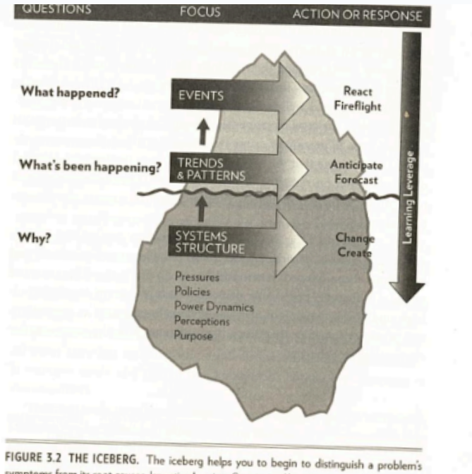

- Mini deliverable, simulation in the room Thursday.
- #cas #nested nested System
	- Each layer is a system, but also part of a greater system. Broken into three broad catagories.
		- #nested Top - landscape view, rules and values are located/created here. slow to change
		- #nested Middle - Meso layer, many of these, where policies are created and interpreted.
		- #nested niche/Micro - bottom layer, most local/most personal, most innovative, where new ideas emerge.
	- Change on one level can be seen on the others.
	- 
- HBC Sayer Trial - Sayer is metis, sells furs outside the HBC monopoly
	- patterns - Grey market of sales in furs, HBC trials
	- Pressures - discrimination, bad prices/poor business, Enterprenureal, stress of poor environment
	- policies - governer; queen; trading partnersl salary v profit
	- power dynamics - crown, ministers, governer
	- Values - race/class/profit
-
- thursday - break into groups, one page hope of things to get, three rounds of negotiation to get rules that are long term sustainable, shock introduced to the system.
-
-
-
-
-
-
-
-
-
-