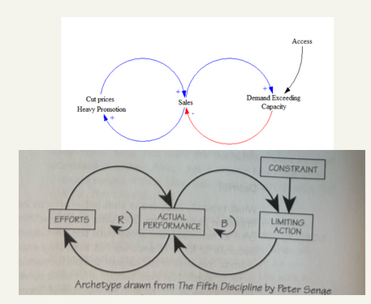

- #proposal - What topic are you considering? who are you and why do you want to explore this? writing quality.
- #dynamics How do we think about causation in a complex system?
- #structures #definition  Parts or Nodes - those parts have relationships and over time produce outcomes
- #structures #definition Variables - parts/things that can change in a system
- #structures #definition Rules/constraints and signals.  The strength and workings of both affect how a system learns, response and adapts.
- #structures #definition Boundaries - although often permeable, degree of this permeaboility is related to the rules and parameters.
- #structures #definition Feedback - When internal parts of the system cause changes.  Becomes a loop when A changes B, that causes a change in A, back and forth.
	- change in A results in change in B
	- B changes in the same way/speed as A
	- B changes inversely to A
	- time delay between A and B
- #structures #definition Causation - can be open or closed
	- open - external forces or shocks effect change
	- closed - mutual/endogenous internal changes in the system trigger response/further changes
- #definition Reinforcing Loop - one action/signal triggers more, similar change
	- Over time, loops can push against the system as a whole, moving it towards change.
- #definition Balancing Loop - One action/signal triggers a response or adaptation as the system seeks balance.
- #definition Tipping point - where the system reinforcing loop has pushed a variable in a system over a parameter and triggers a wider system shift.
	- 
-
-
-
-
-
-
-
-
-