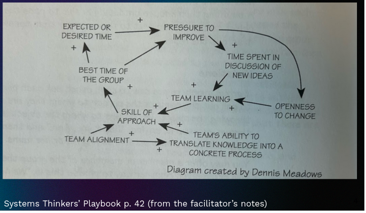
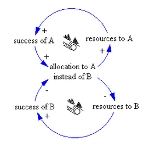
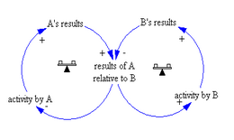
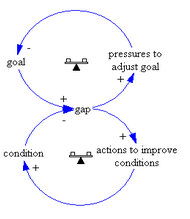
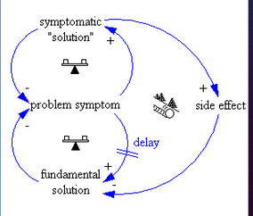

- 
- #loops Reinforcing loops drive growth/shrinkage, balancing loops regulate/seek to maintain balance
	- not all loops are created equal
	- not all loops are created strong
	- #definition  Success to Success - often we see two positive feedback loops, education funding where better test scores mean the school gets more money.
		- 
		- #definition  Escalation - Two positive loops that are growing at the same rate, their relative positions appear stable
			- 
		- #definition Eroding goals - Theres a gap between the goal and the condition in the loops, that one loop causes erosion in the other loop.
			- 
		- #definition Shifting the burden - short term solutions failing to fix long term problems.  Think taking painkillers after an injury to keep working or playing sports, or a bad term, and you work harder for the next term without addressing any of the underlaying problems
			- 
- #definition diversity
	- how many redundancies are in the system?  Most systems require more than source of information, connections, etc.
	- Too much connectivity is bad, hard to cut off disease etc.
	- Too little connectivity is bad, difficult for new ideas or adaptation.  If there's one source of income in a town, and the factory closes, the town can collapse
- #definition Rigidity
	- rigidity can accumulate and the systems becomes insensitive to small/slow changes, or there is no agreement about how to act on change.  This can be seen in economic systems where wealth and authority are centralized, and not accounting for the needs from the bottom of the systems.  This means it may act aggressively to shocks.
	- poverty trap - low connectedness, low resilience
	- rigidity trap - high wealth, high connectedness, high social control, highly resilient, so it can fight off external pressures.
- thursday - pick a case, key stock and flow, feedback loops, rules/constraints, signals.  pick a heuristic or iceberg, explain the system, is it rigid and how does it respond to interventions?
-
-
-
-
-
-
-
-
-